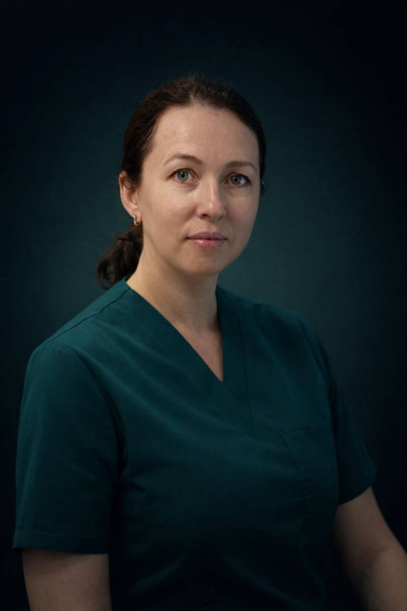
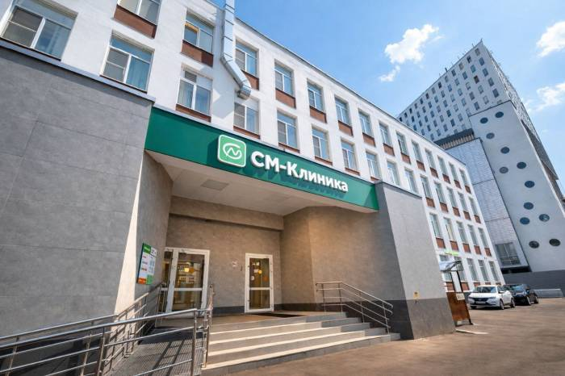
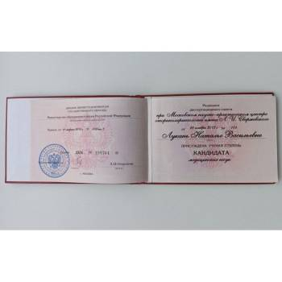

# Инструкция по настройке сайта

## 📸 Требования к фотографиям

### Портретное фото (главный экран)
- **Формат:** JPG или PNG
- **Размер:** 800×1000 пикселей (соотношение 4:5)
- **Вес:** до 500 КБ
- **Качество:** профессиональное портретное фото на нейтральном фоне
- **Освещение:** равномерное, без жестких теней
- **Расположение:** `images/doctor-portrait.jpg`

### Фото интерьера (раздел "Подход")
- **Формат:** JPG или PNG
- **Размер:** 600×700 пикселей
- **Вес:** до 400 КБ
- **Содержание:** интерьер кабинета, оборудование или процесс работы
- **Расположение:** `images/clinic-interior.jpg`

### Сертификаты (блок "Сертификаты и дипломы")
- **Формат:** JPG или PNG
- **Размер:** по высоте 350 пикселей (ширина пропорционально)
- **Вес:** до 200 КБ каждый
- **Качество:** читаемый отсканированный документ
- **Названия файлов:**
  - `images/cert-diploma-kmn.jpg` (диплом к.м.н.)
  - `images/cert-specialist.jpg` (сертификат специалиста)
  - `images/cert-diploma-base.jpg` (базовое образование)
  - `images/cert-conference.jpg` (сертификат конференции)

### Оптимизация фотографий
Рекомендую использовать онлайн-сервисы для сжатия:
- TinyPNG (tinypng.com) - для PNG
- Squoosh (squoosh.app) - универсальный

---

## 🚀 Настройка GitHub Pages

### Шаг 1: Подготовка файлов
```
ваш-репозиторий/
├── index.html              (переименуйте dr-lukan-website.html)
├── publikatsii.html        (создайте позже)
├── lechenie-hrapa.html     (создайте позже)
├── septoplastika.html      (и остальные страницы)
└── images/
    ├── doctor-portrait.jpg
    ├── clinic-interior.jpg
    └── cert-*.jpg
```

### Шаг 2: Загрузка на GitHub
1. Переименуйте `dr-lukan-website.html` в `index.html`
2. Создайте папку `images` в корне репозитория
3. Загрузите все фотографии в папку `images`
4. Загрузите файлы в репозиторий:

```bash
git add .
git commit -m "Initial site upload"
git push origin main
```

### Шаг 3: Активация GitHub Pages
1. Зайдите в ваш репозиторий на GitHub
2. Нажмите **Settings** (вверху справа)
3. В левом меню найдите **Pages**
4. В разделе **Source** выберите:
   - Branch: `main`
   - Folder: `/ (root)`
5. Нажмите **Save**
6. Подождите 1-2 минуты

Ваш сайт будет доступен по адресу:
```
https://ваш-username.github.io/название-репозитория/
```

### Шаг 4: Подключение русского домена

#### У регистратора домена (например, REG.RU):
1. Зайдите в управление DNS-записями
2. Добавьте CNAME-запись:
   ```
   Имя: @
   Тип: CNAME
   Значение: ваш-username.github.io
   ```
3. Добавьте A-записи (для корневого домена):
   ```
   185.199.108.153
   185.199.109.153
   185.199.110.153
   185.199.111.153
   ```

#### В настройках GitHub Pages:
1. Вернитесь в **Settings → Pages**
2. В поле **Custom domain** введите ваш домен: `вашдомен.ru`
3. Поставьте галочку **Enforce HTTPS** (появится через несколько часов)
4. Нажмите **Save**

Создайте файл `CNAME` в корне репозитория со следующим содержимым:
```
вашдомен.ru
```

### Проверка DNS (через 2-24 часа):
```bash
nslookup вашдомен.ru
```

---

## 🔗 Структура страниц для создания

После активации основного сайта, создайте следующие HTML-страницы:

### Обязательные страницы:
1. **publikatsii.html** - список научных публикаций
2. **lechenie-hrapa.html** - подробно о лечении храпа и sleep-эндоскопии
3. **septoplastika.html** - подробно о септопластике
4. **tonzillektomiya.html** - подробно о тонзиллэктомии
5. **endoskopicheskaya-hirurgiya.html** - эндоскопическая хирургия
6. **lechenie-otitov.html** - лечение отитов
7. **lechenie-rinitov.html** - лечение ринитов
8. **adenoidy.html** - лечение аденоидов

### Рекомендации по структуре детальных страниц:
- Заголовок с названием процедуры
- Описание проблемы
- Показания к операции/лечению
- Как проходит процедура (пошагово)
- Реабилитация
- Результаты и эффективность
- Цены (по запросу)
- Форма записи
- Кнопка "Вернуться на главную"

---

## 📝 Замена заглушек на реальные фото

### В файле index.html найдите и замените:

**Портретное фото (строка ~375):**
```html
<!-- Было: -->

<div style="width: 100%; height: 600px...">Портретное фото</div>

<!-- Станет: -->

<!-- удалите <div> с заглушкой -->
```

**Фото интерьера (строка ~660):**
```html
<!-- Было: -->
<div style="width: 100%; height: 500px...">Фото интерьера</div>

<!-- Станет: -->

```

**Сертификаты (4 блока):**
```html
<!-- Было: -->
<div style="width: 100%; height: 350px...">Диплом к.м.н.</div>

<!-- Станет: -->

```

Повторите для всех 4 сертификатов.

---

## 🎨 Дополнительные рекомендации

### Оптимизация для SEO:
- Добавьте `sitemap.xml`
- Настройте `robots.txt`
- Добавьте Open Graph теги для соцсетей
- Подключите Google Analytics

### Безопасность:
- Всегда используйте HTTPS
- Не публикуйте личные номера телефонов в открытом виде (только офисный)

### Обслуживание:
- Регулярно обновляйте отзывы
- Добавляйте новые публикации
- Обновляйте информацию о сертификатах

---

## ❓ Частые проблемы

**Сайт не открывается после публикации:**
- Подождите 5-10 минут
- Проверьте, что файл называется `index.html`
- Проверьте ветку в настройках Pages

**Фото не отображаются:**
- Проверьте пути к файлам (чувствительны к регистру!)
- Убедитесь, что файлы загружены в папку `images`
- Проверьте расширения файлов (.jpg, не .jpeg)

**Домен не работает:**
- DNS-изменения могут занимать до 48 часов
- Проверьте правильность CNAME-записи
- Убедитесь, что файл `CNAME` создан в репозитории

---

Готово! После выполнения всех шагов сайт будет полностью функциональным.
